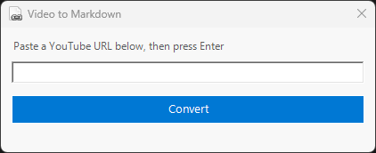
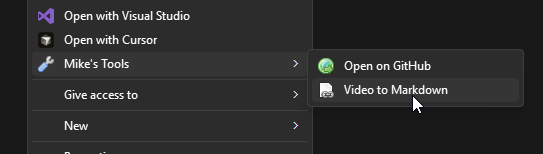

#  youtube-to-markdown

Turn a YouTube link into a clickable markdown thumbnail on your clipboard

Windows · macOS

<!-- media: hero

media: hero -->

Previously called `video-to-markdown`.

## What it is

Give it a YouTube URL and it puts a markdown image link on your clipboard, so when you paste it into a README you get the video thumbnail linking back to the video.

It uses the [video-to-markdown.com](https://video-to-markdown.com) API, which caches things on the server, so asking for the same video twice is pretty much instant.

## Get it

Paste this into your AI coding agent (Claude Code, Codex, Cursor...):

> Clone https://github.com/mikecann/youtube-to-markdown and make it my own. It's one of Mike
> Cann's personal tools, so read the README first, change anything specific to his
> setup to suit mine, then help me get it running.

### Or set it up by hand

You need [Bun](https://bun.sh), Git, and an internet connection. The macOS launcher also uses Python 3 to resolve symlinks. No API keys or `.env` file are needed.

```sh
git clone https://github.com/mikecann/youtube-to-markdown.git
cd youtube-to-markdown
```

On macOS:

```sh
bash install.sh
```

This installs dependencies and links the command into `~/.local/bin`. Add that directory to your shell's PATH if needed. You can choose another directory with `bash install.sh /path/to/bin`, or skip dependency installation with `--skip-deps`.

On Windows, from PowerShell:

```powershell
powershell -ExecutionPolicy Bypass -File .\install.ps1
```

This installs dependencies, writes command stubs into `C:\dev\tools`, and adds **YouTube to Markdown** under the shared **Mike's Tools** Explorer menu. It offers to add the stub directory to your User PATH. Open a new terminal afterwards. Use `-SkipDeps` if dependencies are already installed.

Keep the clone where you installed it. The launchers point at its files, so a `git pull` updates the tool. If you move the clone, rerun the installer.

## Using it

```sh
youtube-to-markdown                       # prompt for a URL
youtube-to-markdown https://youtu.be/dQw4w9WgXcQ
youtube-to-markdown "My Video.url"         # read an Internet Shortcut
```

Copy the YouTube URL before opening the prompt and it will be pre-filled. Press Enter, then paste the result into your Markdown file.

On Windows, right-click a `.url` Internet Shortcut and choose **Mike's Tools > YouTube to Markdown** to read its URL directly. Right-click inside a folder to open the prompt. On Windows 11, you may need **Show more options** first.

The inherited Explorer registrations also appear on files and folder items. Those entries forward the selected path; only `.url` files are accepted by the CLI. For other selections, run the command without arguments or use the folder background entry.

You can also run from the clone without installing a launcher:

```sh
bun run index.ts https://youtu.be/dQw4w9WgXcQ
```

## Screenshots

These screenshots show the earlier command name.




## What it produces

```markdown
[](https://youtu.be/dQw4w9WgXcQ)
```

Paste it into any Markdown file and you get a clickable thumbnail that links back to the video.

## API

`POST https://quirky-squirrel-220.convex.site/api/markdown`

Request:

```json
{ "url": "https://youtu.be/dQw4w9WgXcQ" }
```

Response:

```json
{
  "markdown": "[](https://youtu.be/...)",
  "title": "Video Title",
  "url": "https://youtu.be/..."
}
```

Built on [Convex](https://convex.dev). Thumbnails are hosted on Cloudflare R2 at `thumbs.video-to-markdown.com`. The external service domains retain their names independently of this CLI.

## Dependencies and troubleshooting

- Bun runs the CLI; [@inquirer/prompts](https://www.npmjs.com/package/@inquirer/prompts) handles the URL prompt.
- Windows uses PowerShell `Get-Clipboard` to read and `clip.exe` to write. macOS uses `pbpaste` and `pbcopy`.
- If the command is missing, check PATH and open a new terminal. Run `bun install --frozen-lockfile` from this clone if packages are missing.
- Conversion needs the public API to be available. API errors are printed in the terminal.
- Linux is not a supported install target. Its inherited clipboard fallback has a known `xclip` invocation issue.

## Development

```sh
bun install --frozen-lockfile
bun test
bun build index.ts --target=bun --outdir=dist
pwsh -NoProfile -File tests/check-powershell.ps1
```

Tests mock the API and clipboard. CI runs on macOS and Windows, including PowerShell parsing and installer helper checks. Real Explorer and clipboard integration still need a Windows smoke test.

## Uninstall

On Windows:

```powershell
powershell -ExecutionPolicy Bypass -File .\uninstall.ps1
```

This removes this tool's stubs, Explorer verbs, and generated icon. It keeps the shared menu, other tools, and PATH entries. If you used `-ToolsDir` when installing, pass the same value when uninstalling.

On macOS, remove `~/.local/bin/youtube-to-markdown` (or the symlink in your chosen install directory). You can then delete the clone.

## Icon

`page_white_link.png` is from the [famfamfam silk icon set](https://www.famfamfam.com/lab/icons/silk/) by Mark James, CC BY 2.5. The icon keeps that licence.

## More tools

More of my personal tools live at [mikerosoft.app](https://mikerosoft.app).

MIT licensed.
